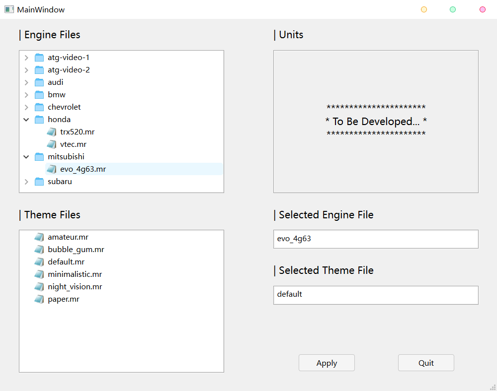
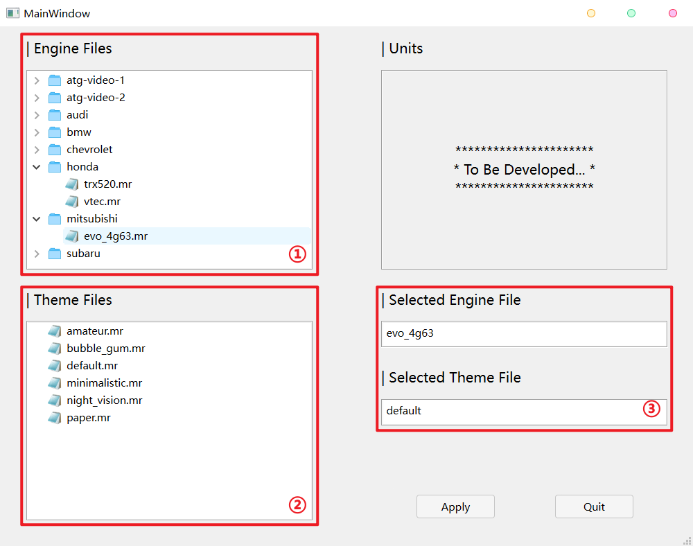
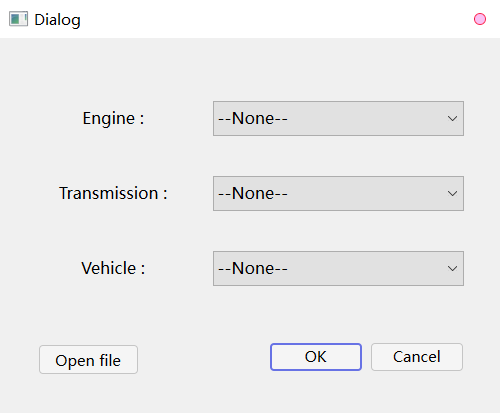
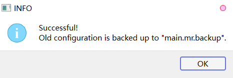
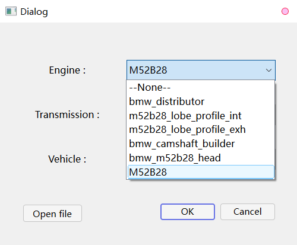

# Config Loader for Engine Sim :car:

English | [简体中文](README.zh-CN.md)

## Table of Contents

- [Config Loader for Engine Sim :car:](#config-loader-for-engine-sim-car)
  - [Table of Contents](#table-of-contents)
  - [Overview](#overview)
  - [Background](#background)
  - [Usage](#usage)
    - [Download](#download)
    - [Unzip](#unzip)
    - [Run](#run)
    - [Example](#example)
  - [Stay Up-to-date](#stay-up-to-date)
  - [What's to Come](#whats-to-come)
  - [Change Log](#change-log)
  - [License](#license)

## Overview



This is a tool for [Engine Sim](https://github.com/ange-yaghi/engine-sim), with concise interactive interface. You can use it to switch engines, themes used in the simulator, and change between imperia and metric units(units changing will be available soon).

Please hit the “:star:**Star**” button in the upper right hand corner, if this project helps you. I really appreciate it.

## Background

When using the "Engine Sim", I always find it troublesome to switch engines. I have to modify the content of ```./assets/main.mr``` manually.

In addition, many engine files are written and uploaded by other users, so the format is not completely standardized. For example, some use the ```set_engine()``` method, while some use ```main()```.

So I wrote this program to make it easier to switch engines and modify the configuration file.

You can find engine files made and uploaded by other users here: [The Parts Catalog](https://catalog.engine-sim.parts/)

---------- Here are some methods provided by the author ----------

[How to change engines](https://github.com/ange-yaghi/engine-sim/wiki/How-to-change-engines)

[Change between imperial and metric units](https://github.com/ange-yaghi/engine-sim/wiki/Changing-between-imperial-and-metric-units)

[More](https://github.com/ange-yaghi/engine-sim/wiki/Frequently-Asked-Questions)

## Usage

### Download

Visit the [release page](https://github.com/Golevka2001/Config-Loader-for-Engine-Sim/releases), find the latest version, click "Assets" and download the file ```Config_Loader_for_Engine_Sim-vx_x_x.zip```.

### Unzip

Unzip the the file ```Config_Loader_for_Engine_Sim-vx_x_x.zip```, and you will get a folder(can be renamed). Move the folder to the directory of ```Engine Sim``` (in the same path as ```engine-sim-app.exe```).


For convenience, you can create a shortcut for ```Config_Loader_for_Engine_Sim.exe``` in this folder.

:warning: **But do not change the location of the executable file.**

### Run

Double click the executable file or the corresponding shortcut to run.

The main window:



① - Engine file directory
② - Theme file directory
③ - Current selected engine and theme files

Select the engine file in ①, select the theme file in ②, and click the "Apply" button to write into ```./assets/main.mr```.

For some engine files, the program cannot determine the content to be written, and the following dialog box pops up. Users need to manually select:



Click the "OK" button after selection. The modification is successful when the following dialog box pops up, and the old configuration file is backed up to ```./assets/main.mr.backup```:



Go back to the simulator, press **Enter** to update the settings.

### Example

Take the engine *BMW-M52B28* as an example, the file contains several public nodes. So users need to select according to their names(only `` M52B28 `` in the figure refers to an engine)



If you are not sure about the names, click the "Open file" button to view the engine file.


## Stay Up-to-date

There will be more updates to improve functions or fix bugs.You can click the “:eyes:**Watch**” button in the upper right hand corner to receive notification when the project is updated.

## What's to Come

1. Read old ```main.mr``` file on every run, and set as default values, so users don't need to change every options;
2. Change between imperial and metric units；
3. Preview of themes；
4. More beautiful；
5. ...

You can put forward the problems encountered and the functions you wish to add on the "Issues" page.

## Change Log

**[2022-10-24] Version: 2.0.1:**

1. Fix the fault of the "Open file" button in the dialog box.

**[2022-10-24] Version: 2.0.0:**

1. You can now switch themes;
2. Fix some bugs about the selection dialog.

**[2022-10-23] Version: 1.1.0:**

1. Add checks for files and paths;
2. Modify the judgment on the contents of engine files;
3. Modify control layout.

**[2022-10-21] Version: 1.0.0:**

1. Display local engine files in tree view. The engine used in the simulator is selected by users, and the program writes into ```./assets/main.mr```.

## License

[GNU GENERAL PUBLIC LICENSE v2.0 © Gol3vka.](./LICENSE)
