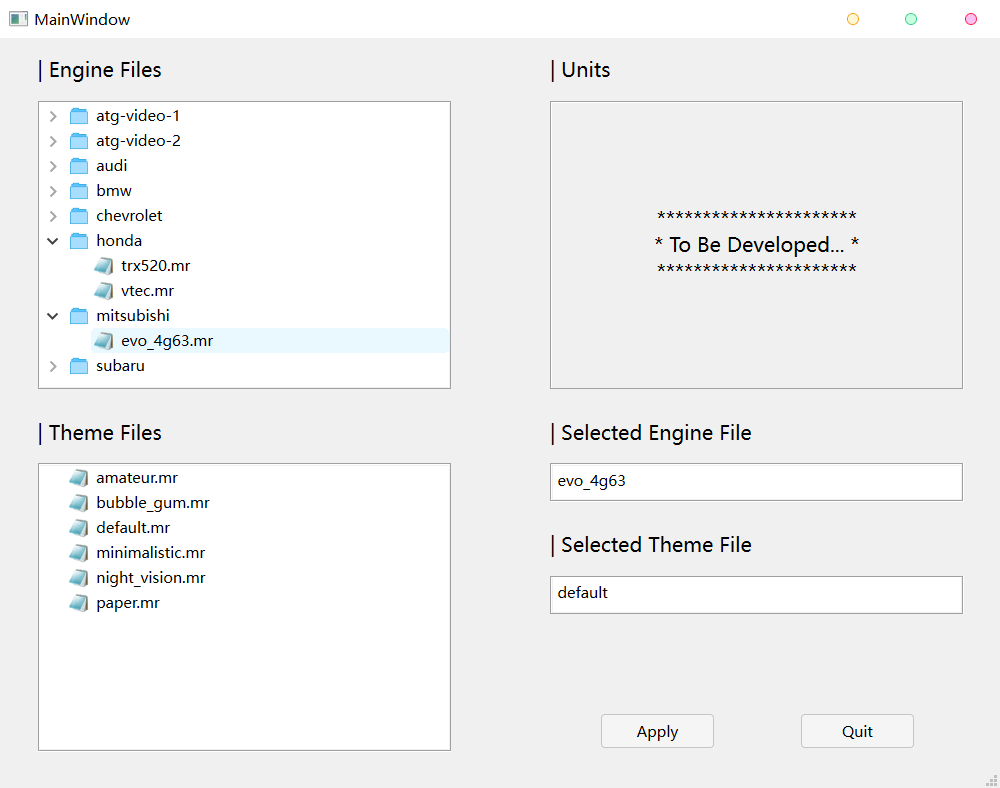
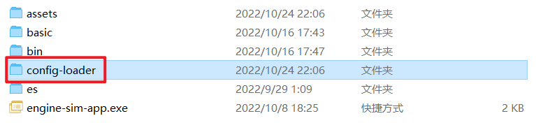
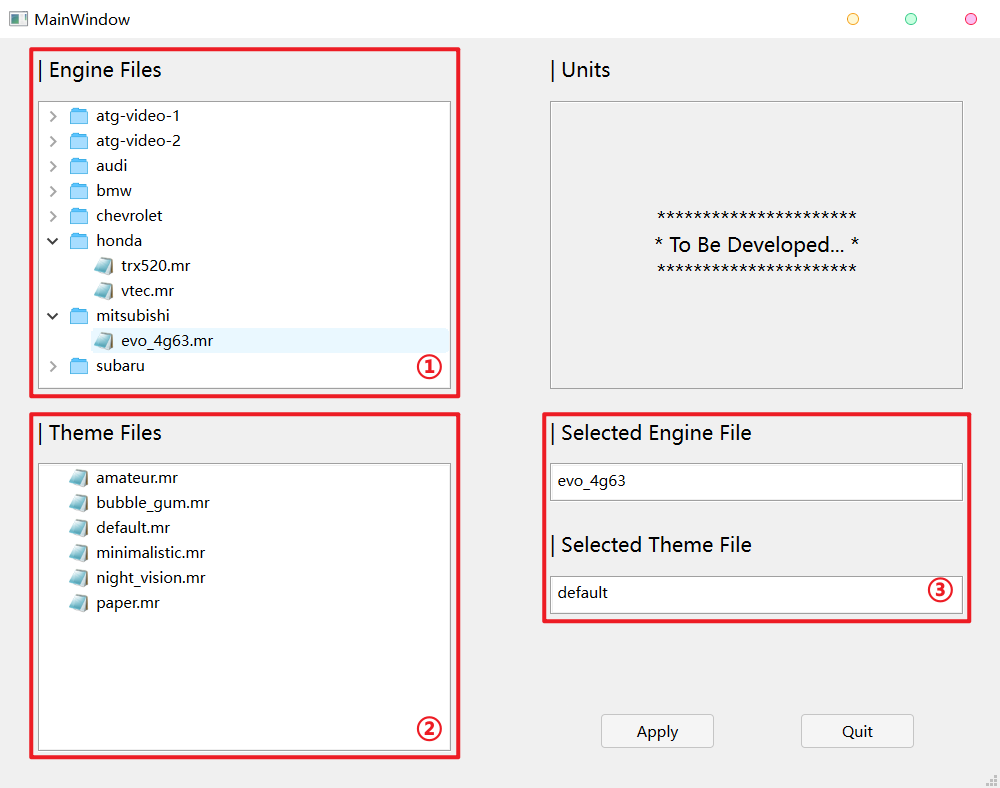
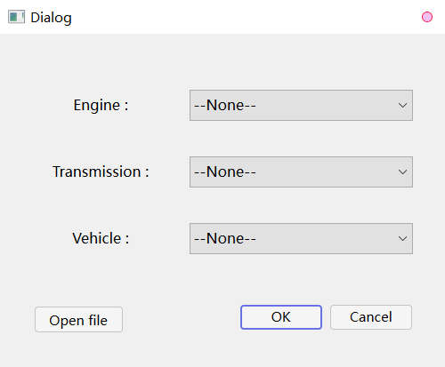
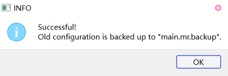
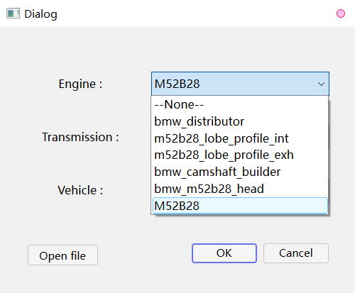
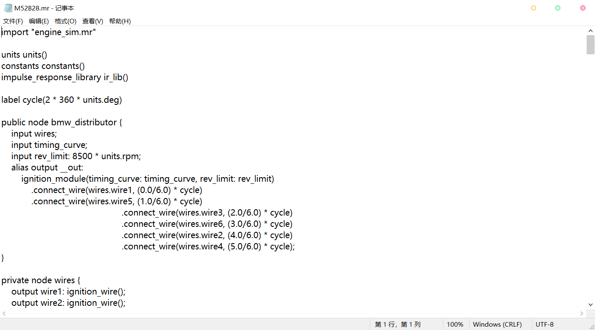

# Config Loader for Engine Sim :car:

[English](README.md) | 简体中文

## 目录

- [Config Loader for Engine Sim :car:](#config-loader-for-engine-sim-car)
  - [目录](#目录)
  - [概述](#概述)
  - [背景](#背景)
  - [使用说明](#使用说明)
    - [下载](#下载)
    - [解压](#解压)
    - [运行](#运行)
    - [示例](#示例)
  - [获取最新版本](#获取最新版本)
  - [未来更新内容](#未来更新内容)
  - [更新日志](#更新日志)
  - [使用许可](#使用许可)

## 概述



这是一个用于 [Engine Sim](https://github.com/ange-yaghi/engine-sim) 的配置加载程序，具有简明的交互界面，可以方便地切换模拟器中使用的引擎、主题和公英制单位（切换单位功能将在后续更新）。

如果这个项目有帮助到您，可以点击右上角的 “:star:**Star**” 按钮。感谢您的支持。

## 背景

在使用 Engine Sim 的时候总觉得换引擎很麻烦，需要去手动修改 ```./assets/main.mr``` 的内容。

除此之外，由于很多引擎文件是由用户编写上传的，所以格式并不完全规范，比如有的需要使用 ```set_engine()``` 方法来设置引擎，而有的使用 ```main()``` 。

所以我写了这个程序，用于更方便地切换引擎，由程序来写入配置文件。

可以在这里找到其他用户制作、上传的引擎文件：[The Parts Catalog](https://catalog.engine-sim.parts/)

---------- 以下是原作者提供的一些方法 ----------

[如何切换引擎](https://github.com/ange-yaghi/engine-sim/wiki/How-to-change-engines)

[英制单位与公制单位之间的切换](https://github.com/ange-yaghi/engine-sim/wiki/Changing-between-imperial-and-metric-units)

[更多](https://github.com/ange-yaghi/engine-sim/wiki/Frequently-Asked-Questions)

## 使用说明

### 下载

访问[发布页面](https://github.com/Golevka2001/Config-Loader-for-Engine-Sim/releases)，找到最近发布版本，点击 “Assets” 并下载其中的 ```Config_Loader_for_Engine_Sim-vx_x_x.zip```。

### 解压

解压下载的 ```Config_Loader_for_Engine_Sim-vx_x_x.zip``` 文件，得到一个文件夹（可以重命名），将文件夹移动到 ```Engine Sim``` 的目录下（与   ```engine-sim-app.exe``` 在同一路径下）。



为方便使用，可以为该文件夹中的 ```Config_Loader_for_Engine_Sim.exe``` 创建快捷方式。

:warning: **但请不要更改可执行文件的位置。**

### 运行

双击可执行文件或相应的快捷方式运行。

主窗口如下：



① - 引擎文件目录
② - 主题文件目录
③ - 当前所选择的引擎与主题

在 ① 中选择所要应用的引擎文件，在 ② 中选择所要应用的主题文件，点击 “Apply” 按钮写入 ```./assets/main.mr```。

对于部分引擎文件，程序无法确定写入内容，弹出以下对话框由用户手动选择：



选择完毕后点击 “OK” 按钮，当弹出以下对话框时表明修改成功，且旧的配置文件被备份为 ```./assets/main.mr.backup```：



回到 Engine Sim 程序中，按下 **回车键** 来更新设置。

### 示例

以 *BMW-M52B28* 这款引擎为例，文件中包含多个 “public nodes”，需要用户根据名字来选择（图中只有 ```M52B28``` 对应着引擎）。



如果只看名字拿不准的话，可以点击对话框左下角的 “Open file” 按钮来查看引擎文件。



## 获取最新版本

未来还会有较多更新，完善功能或修复错误，您可以点击右上角的 “:eyes:**Watch**”  按钮，当项目有更新时可以收到通知。

## 未来更新内容

- [x] ~~每次运行时，读取旧的 ```main.mr``` 文件，并设置为默认值，用户就不需要每次修改所有的选项；~~
- [ ] 增加切换英制、公制单位的功能；
- [ ] 增加主题的预览；
- [ ] 更加美观；
- [ ] ...

您可以在 “Issues” 页面提出遇到的问题和希望加入的功能。

## 更新日志

**[2022-10-31] Version: 2.1.0:**

1. 重构了代码，更加规范化；
2. 新增读取旧配置文件作为默认值的功能；
3. 修复相对路径引起的错误。

**[2022-10-24] Version: 2.0.1:**

1. 修复对话框中“Open file”按钮失效的问题。

**[2022-10-24] Version: 2.0.0:**

1. 新增切换主题的功能；
2. 修复手动选择部分对话框的一些bug。

**[2022-10-23] Version: 1.1.0:**

1. 新增对文件、路径的检查；
2. 修改对引擎文件内容的判断，对于部分引擎文件，程序无法确定写入内容，需要用户手动选择；
3. 修改控件布局。

**[2022-10-21] Version: 1.0.0:**

1. 展示存储引擎文件的目录树，用户选择所要在模拟器中使用的引擎，由程序写入 ```./assets/main.mr``` 文件。

## 使用许可

[GNU GENERAL PUBLIC LICENSE v2.0 © Gol3vka.](./LICENSE)
